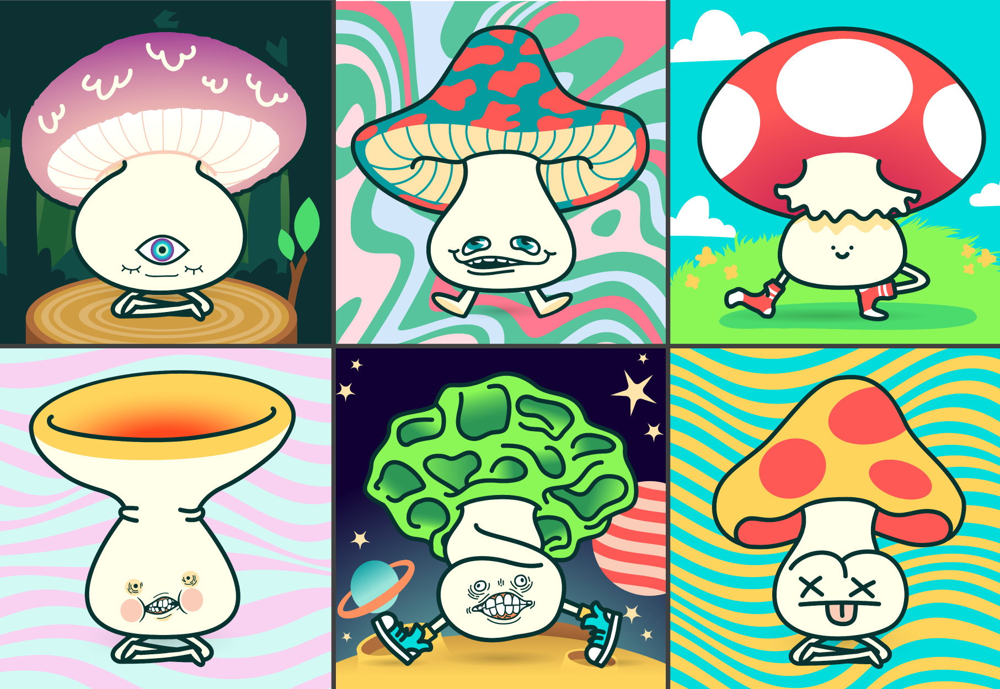

# FundGuys

A Public Goods Funding Platform on Base that allows campaign creators to choose a preferred token and automatically swaps donations using the 0x API. Additionally, first time funders are rewarded with Mycologuys NFTs!

## Public Goods Funding Platform

Follow the steps below to get started:

1. Connect Wallet
2. Create a campaign
3. Fund your favourite campaign!

Bonus: Click Share to share their story on Warpcast!

All donations above 10 USDC will come with an automatic mint for a Fund Guy (Mycologuys) NFT! _This only applies to unique addresses_

## Mycologuys NFT Collection



## Usage

The Fund Guys developers strongly believe in the ethos of open source contribution and development. So, feel free to fork this repo and make this your own super awesome 🏗️!

_Be sure to also 🌟 this repo!_

### Quickstart for Devs

To get started with Fund Guys, follow the steps below:

1. Clone this repo:

   ```
   git clone https://github.com/MattPereira/FundGuys.git
   ```

2. Change directory:

   ```
   cd FundGuys
   ```

3. Install dependencies:

   ```
   yarn install
   ```

4. Start NextJS App:

   ```
   yarn start
   ```

## Contribution

We are open for contributions! This was built in ETH Denver Hackathon which was a jam-packed Hackathon. Many more features are planned in the pipeline. Connect with us if you'd like to contribute!

- https://github.com/MattPereira
- https://github.com/swellander
- https://github.com/PrintRH
